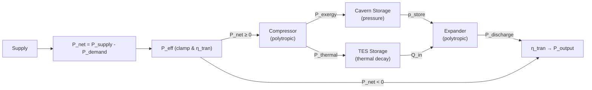
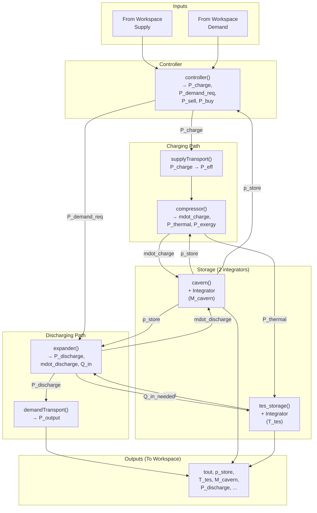

# Transforming EST Template → I-CAES Simulink Model

## Background

The current EST Simulink template models a **generic energy storage system** with 5 blocks (Supply Transport → Injection → Storage → Extraction → Demand Transport), where each block uses simple dissipation coefficients (`a·P` or `b·E`). Your I-CAES model from `1. text.tex` is fundamentally different:

- **Two separate storages** (Cavern for pressure exergy + TES for thermal energy) instead of one
- **Polytropic compression/expansion** physics instead of linear dissipation
- **Dynamic state variables**: cavern pressure `p_store(t)`, TES temperature `T_tes(t)`, air mass `M_cavern(t)`
- **Mode-dependent behaviour**: charging vs. discharging follows entirely different physics

---

## Architecture Comparison

### Original Template Flow
```
Supply → [Transport] → [Injection] → [Storage] → [Extraction] → [Transport] → Demand
              a·P           a·P         b·E           a·P             a·P
```

### New I-CAES Flow


---

## User Review Required

> [!IMPORTANT]
> **Simulink `.slx` cannot be edited programmatically** — I can write all MATLAB scripts and function files, but **you must modify the Simulink block diagram manually**. The plan below clearly separates what I do (scripts) vs. what you do (Simulink GUI).

> [!WARNING]
> **The template has 1 storage integrator; your model needs 3** (cavern mass, cavern pressure, TES temperature). This requires restructuring the core of the Simulink model. The simplest approach is to **replace the interior of the existing subsystems** while keeping the outer signal routing.

---

## Open Questions

> [!IMPORTANT]
> 1. **Polytropic index `n`**: Your text says `n ≈ 1.05–1.2` for near-isothermal, but preprocessing.m currently has `n = 1.4` (adiabatic). Which value do you want? I suggest `n = 1.1` as default.
> 2. **Cavern volume `V_cavern`**: Not mentioned in parameters yet. Needed to compute `p_store(t)` from air mass via ideal gas law. Do you have a value? (e.g. 310,000 m³ like Huntorf?)
> 3. **Initial cavern air mass `M_cavern_initial`**: Derived from `p_store_initial`, `V_cavern`, and `T_amb`. Should I compute it automatically?
> 4. **TES inlet temperature `T_in`**: During expansion, TES heats the air. What is `T_in` for the expander? Is it `T_tes(t)` (current TES temperature)?
> 5. **Maximum mass flow rate**: Your text mentions `ṁ_max` as a parameter but leaves it blank. Do you have a value or should we compute it from pipe geometry (`ρ·v·A`)?
> 6. **`η_thermal`**: Your text defines it as a derived quantity. Should I compute it from the polytropic relation, or use a fixed coefficient?
> 7. **Parameter values**: Your text specifies `P_limit = 300 MW`, `η_tran = 0.97`, `η_comp = 0.833`, `p_store = 80 bar`, `T_amb = 300 K`. The current preprocessing.m has different values (from the previous edit). Should I update to match the text?

---

## Proposed Changes

### Component 1: Unit System Extension

#### [MODIFY] [constants.m](file:///d:/OneDrive%20-%20TU%20Eindhoven/Study/CBL%20Energy%20Storage%20Y1Q4/Year1Q4-CBL-EST-Group38/EST-model-main/scripts/constants.m)

Add missing SI units needed by the thermodynamic model:

```matlab
% pressure
unit("Pa")  = unit("J") / 1;           % 1 Pa = 1 J/m³ (but we treat as base)
unit("bar") = 1e5 * unit("Pa");

% temperature (as scaling factor, base = K)
unit("K") = 1;

% mass
unit("kg") = 1;

% length / area / volume
unit("m")   = 1;
unit("m^2") = 1;
unit("m^3") = 1;
```

> [!NOTE]
> The existing `unit()` map only has time, energy, and power. Our thermodynamic model needs pressure, temperature, mass, and length. Because `unit()` is used as a dimensional scaling map (not a full unit system), we add them as dimensionless scale factors (base SI = 1).

---

### Component 2: Preprocessing Script

#### [MODIFY] [preprocessing.m](file:///d:/OneDrive%20-%20TU%20Eindhoven/Study/CBL%20Energy%20Storage%20Y1Q4/Year1Q4-CBL-EST-Group38/EST-model-main/preprocessing.m)

Rewrite the `System parameters` section. The full updated file will contain:

**Section 1 — Data loading** (unchanged)

**Section 2 — Simulation settings** (unchanged)

**Section 3 — Physical Constants** (update values to match `1. text.tex`):
| Parameter | Symbol | Value | Source |
|---|---|---|---|
| Atmospheric pressure | `p_amb` | 101325 Pa | Standard |
| Ambient temperature | `T_amb` | 300 K | text.tex §3.1 |
| Specific gas constant of air | `R_air` | 287.05 J/(kg·K) | Standard |
| Specific heat of air | `c_p` | 1005 J/(kg·K) | Standard |
| Specific heat of TES medium | `c_tes` | 4184 J/(kg·K) | text.tex §3.1 (water) |
| Polytropic index | `n` | 1.1 (placeholder) | text.tex §2.4 says 1.05–1.2 |

**Section 4 — System Design Parameters**:
| Parameter | Symbol | Value | Source |
|---|---|---|---|
| Transmission efficiency | `eta_tran` | 0.97 | text.tex §3.3 |
| Compressor efficiency | `eta_comp` | 0.833 | text.tex §3.3 |
| Expander efficiency | `eta_exp` | 0.85 (placeholder) | text.tex leaves blank |
| Power limit | `P_limit` | 300 MW | text.tex §3.2 |
| TES heat transfer coeff. | `U_tes` | 50 W/(m²·K) | placeholder |
| TES surface area | `A_tes` | TBD m² | text.tex leaves blank |
| TES mass | `m_tes` | TBD kg | text.tex leaves blank |
| Pipe diameter | `D` | TBD m | text.tex leaves blank |
| Flow velocity | `v` | TBD m/s | — |
| Cavern volume | `V_cavern` | TBD m³ | **NEW – needed** |
| Max storage pressure | `p_store_max` | 80×10⁵ Pa | text.tex §3.2 |

**Section 5 — Initial Conditions**:
| Parameter | Symbol | Value |
|---|---|---|
| Initial TES temperature | `T_tes_initial` | `T_amb` (= 300 K) |
| Initial storage pressure | `p_store_initial` | 10 bar (placeholder) |
| Initial cavern air mass | `M_cavern_initial` | computed from `p_store_initial·V_cavern/(R_air·T_amb)` |

**Section 6 — Derived / Helper Quantities** (computed, not constants):
```matlab
A_pipe = pi/4 * D^2;                         % Pipe cross-section
rho_amb = p_amb / (R_air * T_amb);            % Ambient air density
mdot_max = rho_amb * v * A_pipe;              % Max mass flow rate (from pipe geometry)
```

---

### Component 3: Simulink Block Restructuring (Manual — by YOU)

This is the most significant change. The original 5-block linear chain must be restructured.

#### Step 3a: Rewrite the `Injection` block → **Compressor**

The old `injection` function was:
```matlab
function [PfromInjection, DInjection] = injection(PtoInjection, aInjection)
    DInjection = aInjection * PtoInjection;
    PfromInjection = PtoInjection - DInjection;
```

**Replace with** new MATLAB Function block `compressor`:

```matlab
function [mdot_charge, P_thermal, P_exergy, T_out_comp] = compressor(P_charge, ...
    eta_comp, n, R_air, c_p, T_amb, p_store, p_amb)
%COMPRESSOR  Polytropic compression: converts electrical power into
%            thermal power (→TES) and pressure exergy (→Cavern).
%
%   Equations from 1.text.tex: (2.8), (2.9), (2.10), (2.11)

    % Polytropic compression factor
    pressure_ratio = p_store / p_amb;
    poly_factor = (n/(n-1)) * R_air * T_amb * (pressure_ratio^((n-1)/n) - 1);

    % Mass flow rate from available charging power  [Eq. 2.9]
    mdot_charge = P_charge / (eta_comp * poly_factor);

    % Compressor outlet temperature  [Eq. below 2.9 in text]
    T_out_comp = T_amb * pressure_ratio^((n-1)/n);

    % Thermal power to TES  [Eq. 2.10]
    %   P_thermal = P_charge - mdot · c_p · (T_out - T_in)
    %   (the "waste heat" that goes to TES)
    P_thermal = P_charge - mdot_charge * c_p * (T_out_comp - T_amb);

    % Pressure exergy rate stored in cavern  [Eq. 2.11]
    P_exergy = mdot_charge * R_air * T_amb * log(pressure_ratio);
end
```

**Inputs needed from Simulink wires**: `P_charge`, and all the constant parameters (can come from workspace).  
**Key dynamic input**: `p_store` (current cavern pressure — comes from cavern state).

#### Step 3b: Replace the single `Storage` block → **Two Integrators**

The old storage was a single ODE: `Ė = P_in − P_out − b·E`.

**New Storage 1 — Cavern (pressure/mass accumulation):**

```matlab
function [p_store, Mdot_cavern] = cavern(mdot_charge, mdot_discharge, ...
    M_cavern, R_air, T_amb, V_cavern, p_store_max)
%CAVERN  Tracks air mass and computes storage pressure via ideal gas law.
%
%   State variable: M_cavern (integrated externally by Simulink integrator)
%   Output: p_store = M_cavern · R_air · T_amb / V_cavern

    % Net mass flow rate (+ charging, − discharging)
    Mdot_cavern = mdot_charge - mdot_discharge;

    % Current pressure from ideal gas law (cavern is isothermal at T_amb)
    p_store = M_cavern * R_air * T_amb / V_cavern;

    % Clamp pressure to maximum
    p_store = min(p_store, p_store_max);
end
```

In Simulink: `Mdot_cavern` → **Integrator** (IC = `M_cavern_initial`) → feeds back as `M_cavern`.

**New Storage 2 — TES (thermal decay):**

```matlab
function [T_tes_dot, Q_loss] = tes_storage(P_thermal_in, Q_discharge_out, ...
    T_tes, T_amb, U_tes, A_tes, m_tes, c_tes)
%TES_STORAGE  Thermal energy storage with Newton's law cooling.
%
%   State variable: T_tes (integrated externally by Simulink integrator)
%   ODE: m_tes·c_tes · dT_tes/dt = P_thermal_in − Q_discharge_out − U·A·(T_tes − T_amb)
%   Equation from 1.text.tex: (2.12), (2.13)

    % Heat loss to environment [Eq. 2.12]
    Q_loss = U_tes * A_tes * (T_tes - T_amb);

    % Temperature rate of change [Eq. 2.13]
    T_tes_dot = (P_thermal_in - Q_discharge_out - Q_loss) / (m_tes * c_tes);
end
```

In Simulink: `T_tes_dot` → **Integrator** (IC = `T_tes_initial`) → feeds back as `T_tes`.

#### Step 3c: Rewrite the `Extraction` block → **Expander**

```matlab
function [P_discharge, mdot_discharge, Q_in_needed, T_out_exp] = expander(P_demand_required, ...
    eta_exp, eta_tran, n, R_air, c_p, T_tes, p_store, p_amb)
%EXPANDER  Polytropic expansion: converts pressure exergy + TES heat → electricity.
%
%   Equations from 1.text.tex: (2.15), (2.18)

    % Expansion factor
    pressure_ratio_exp = p_amb / p_store;
    poly_factor_exp = (n/(n-1)) * R_air * T_tes * (1 - pressure_ratio_exp^((n-1)/n));

    % Required discharge power (what the grid needs after transmission)
    P_discharge_target = P_demand_required / eta_tran;

    % Mass flow rate to meet demand  [rearranged Eq. 2.15]
    mdot_discharge = P_discharge_target / (eta_exp * poly_factor_exp);

    % Actual discharge power  [Eq. 2.15]
    P_discharge = eta_exp * poly_factor_exp * mdot_discharge;

    % Expander outlet temperature
    T_out_exp = T_tes * pressure_ratio_exp^((n-1)/n);

    % Thermal power drawn from TES  [Eq. 2.18]
    Q_in_needed = P_discharge / eta_exp - mdot_discharge * c_p * (T_tes - T_out_exp);
end
```

#### Step 3d: Rewrite `Transport from supply` and `Transport to demand`

These become simple efficiency multipliers (no longer `a·P` dissipation):

```matlab
% Transport from supply (same structure, just use eta_tran)
function [P_eff, D_tran] = supplyTransport(P_net_positive, eta_tran, P_limit)
    P_clamped = min(P_net_positive, P_limit);
    P_eff = eta_tran * P_clamped;
    D_tran = P_clamped - P_eff;
end
```

```matlab
% Transport to demand
function [P_output, D_tran] = demandTransport(P_discharge, eta_tran)
    P_output = eta_tran * P_discharge;
    D_tran = P_discharge - P_output;
end
```

#### Step 3e: Rewrite the `Controller`

The controller must now decide between **charging** and **discharging** mode:

```matlab
function [P_charge, P_demand_required, P_sell, P_buy] = controller(P_supply, P_demand, ...
    p_store, p_store_max, p_amb)
%CONTROLLER  Decides charging vs. discharging mode based on P_net.
%
%   Eq. 2.5: P_net = P_supply − P_demand

    P_net = P_supply - P_demand;

    if P_net >= 0
        % Surplus → charge storage
        P_charge = P_net;
        P_demand_required = 0;
        P_sell = 0;  % could add: sell if cavern is full
        P_buy = 0;
    else
        % Deficit → discharge storage
        P_charge = 0;
        P_demand_required = -P_net;  % positive value
        P_sell = 0;
        P_buy = 0;   % could add: buy if cavern is empty
    end

    % Safety: stop charging if pressure at max
    if p_store >= p_store_max
        P_sell = P_charge;
        P_charge = 0;
    end

    % Safety: stop discharging if pressure at ambient
    if p_store <= p_amb * 1.1 && P_demand_required > 0
        P_buy = P_demand_required;
        P_demand_required = 0;
    end
end
```

---

### Component 4: Simulink Wiring Diagram (for YOU to build manually)

Here is the signal flow you need to wire in Simulink:



#### What you need to do in Simulink (manual steps):

1. **Open `EST.slx`** in Simulink
2. **Delete or clear** the interior of the existing `Injection`, `Storage`, `Extraction` subsystem blocks
3. **Add 2 Integrator blocks** (one for `M_cavern`, one for `T_tes`), with initial conditions from workspace variables
4. **Add 4 MATLAB Function blocks**: `compressor`, `cavern`, `tes_storage`, `expander`
5. **Rewire** the `Controller` block to use the new logic
6. **Add `To Workspace` blocks** for the new signals: `p_store`, `T_tes`, `M_cavern`, `mdot_charge`, `P_thermal`, `P_exergy`, etc.
7. **Update the existing `To Workspace` blocks** — the template already logs `EStorage`, `D`, etc.; these need to be replaced with the new variable names

> [!TIP]
> The easiest approach: keep the outer structure, but **double-click each subsystem** and replace its contents. The `compressor` replaces `Injection`, the `expander` replaces `Extraction`, and the `Storage` subsystem gets split into two parallel paths (Cavern + TES).

---

### Component 5: Postprocessing Script

#### [MODIFY] [postprocessing.m](file:///d:/OneDrive%20-%20TU%20Eindhoven/Study/CBL%20Energy%20Storage%20Y1Q4/Year1Q4-CBL-EST-Group38/EST-model-main/postprocessing.m)

Update plots to show the new state variables:

- **Subplot 1**: Supply & Demand (unchanged)
- **Subplot 2**: Cavern pressure `p_store(t)` over time
- **Subplot 3**: TES temperature `T_tes(t)` over time
- **Subplot 4**: Load balancing (Buy/Sell — similar logic)
- **New Figure**: Energy breakdown (thermal vs. exergy stored)
- **New Figure**: Mass flow rates over time

---

### Component 6: New MATLAB Function Files

#### [NEW] [scripts/compressor.m](file:///d:/OneDrive%20-%20TU%20Eindhoven/Study/CBL%20Energy%20Storage%20Y1Q4/Year1Q4-CBL-EST-Group38/EST-model-main/scripts/compressor.m)
Standalone version of the compressor function (for testing outside Simulink).

#### [NEW] [scripts/expander.m](file:///d:/OneDrive%20-%20TU%20Eindhoven/Study/CBL%20Energy%20Storage%20Y1Q4/Year1Q4-CBL-EST-Group38/EST-model-main/scripts/expander.m)
Standalone version of the expander function.

#### [NEW] [scripts/cavern.m](file:///d:/OneDrive%20-%20TU%20Eindhoven/Study/CBL%20Energy%20Storage%20Y1Q4/Year1Q4-CBL-EST-Group38/EST-model-main/scripts/cavern.m)
Standalone version of the cavern storage function.

#### [NEW] [scripts/tes_storage.m](file:///d:/OneDrive%20-%20TU%20Eindhoven/Study/CBL%20Energy%20Storage%20Y1Q4/Year1Q4-CBL-EST-Group38/EST-model-main/scripts/tes_storage.m)
Standalone version of the TES storage function.

---

## Equation-to-Block Mapping

| Equation # | Description | LaTeX | Simulink Block |
|---|---|---|---|
| 2.5 | Net power | `P_net = P_supply − P_demand` | Controller |
| 2.6 | Effective power | `P_eff = η_tran · min(P_net, P_limit)` | supplyTransport |
| 2.8 | Polytropic compression | `P_charge = η_comp · (n/(n−1)) · ṁ · R · T · [...]` | Compressor |
| 2.9 | Charge mass flow | `ṁ_charge = P_charge / (η_comp · ...)` | Compressor |
| 2.10 | Thermal power to TES | `P_thermal = P_charge − ṁ · c_p · (T_out − T_in)` | Compressor |
| 2.11 | Pressure exergy rate | `P_exergy = ṁ · R · T · ln(p_store/p_amb)` | Compressor |
| 2.12 | TES heat loss | `Q_loss = U·A·(T_tes − T_amb)` | TES Storage |
| 2.13 | TES temperature ODE | `m·c · dT/dt = −U·A·(T−T_amb)` | TES Storage + Integrator |
| 2.15 | Polytropic expansion | `P_discharge = η_exp · (n/(n−1)) · ṁ · R · T · [...]` | Expander |
| 2.18 | TES heat draw | `Q_in = P_discharge/η_exp − ṁ·c_p·(T_in−T_out)` | Expander |
| 2.19 | Output power | `P_output = η_tran · P_discharge` | demandTransport |

---

## Division of Work

### What I will do (code changes):
- [x] ~~Update `preprocessing.m`~~ (already done in previous conversation turn)
- [ ] Fix `preprocessing.m` values to match `1. text.tex` (update `n`, `eta_tran`, `P_limit`, etc.)
- [ ] Update `constants.m` with new unit types
- [ ] Create standalone MATLAB function files in `scripts/`
- [ ] Update `postprocessing.m` for new plots

### What you need to do (Simulink GUI):
- [ ] Open `EST.slx` and study the current block layout
- [ ] Replace `Injection` subsystem internals with `compressor()` MATLAB Function block
- [ ] Replace `Storage` subsystem with two parallel paths (Cavern + TES), each with an Integrator
- [ ] Replace `Extraction` subsystem internals with `expander()` MATLAB Function block
- [ ] Update `Controller` block with new mode-switching logic
- [ ] Wire `p_store` feedback from Cavern integrator to Compressor and Controller
- [ ] Wire `T_tes` feedback from TES integrator to Expander
- [ ] Add `To Workspace` blocks for new signals
- [ ] Set Integrator initial conditions from workspace (`M_cavern_initial`, `T_tes_initial`)

---

## Verification Plan

### Automated Tests
1. **Unit test each function**: Run `compressor()`, `expander()`, `cavern()`, `tes_storage()` standalone with known inputs and verify outputs against hand calculations
2. **Steady-state check**: With constant `P_supply` and zero demand, verify `p_store` increases linearly and `T_tes` rises then saturates
3. **Energy conservation**: Verify total energy in = total energy out + losses (integrate all power signals)

### Manual Verification
1. Run the Simulink model with the charge/discharge cycle data and inspect plots
2. Compare TES temperature decay curve against the analytical solution: `T_tes(t) = T_amb + (T_initial − T_amb)·exp(−U·A·t/(m·c))`
3. Verify cavern pressure stays within `[p_amb, p_store_max]`
