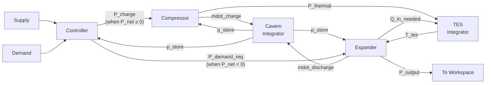

# I-CAES Simulink Modification Guide

This guide tells you exactly what to change in `EST.slx` to implement the I-CAES model. All MATLAB code files (`preprocessing.m`, `postprocessing.m`, `constants.m`) are already updated — this document covers only **Simulink GUI changes**.

## Corrected System Flow



**Key rule**: When surplus (P_net ≥ 0) → Compressor charges Cavern + TES. When deficit (P_net < 0) → Expander draws from Cavern + TES.

---

## Step 0 — Preparation

1. **Make a backup** of `EST.slx` (copy it to `EST_backup.slx`)
2. Open `EST.slx` in Simulink
3. Note the current layout: Supply → Transport → Injection → Storage → Extraction → Transport → Demand, with a Controller

---

## Step 1 — Delete Old Blocks

Delete the **internal contents** of these subsystems (or delete the blocks entirely):
- `Transport from supply`
- `Injection`
- `Storage` (including its integrator)
- `Extraction`
- `Transport to demand`

Keep the `Supply`, `Demand`, `Controller`, and all `To Workspace` / `From Workspace` blocks for now.

---

## Step 2 — Add the Controller Block

Replace the existing Controller with a new **MATLAB Function** block. Double-click it and paste:

```matlab
function [P_charge, P_demand_req, P_sell, P_buy] = controller( ...
    P_supply, P_demand, p_store, ...
    eta_tran, P_limit, p_store_max, p_amb)
%CONTROLLER  Determines charging/discharging mode based on P_net.
%   P_net >= 0  →  charge (compress air)
%   P_net <  0  →  discharge (expand air)

    P_net = P_supply - P_demand;

    % Default outputs
    P_charge = 0;
    P_demand_req = 0;
    P_sell = 0;
    P_buy = 0;

    if P_net >= 0
        % === CHARGING MODE ===
        P_available = min(P_net, P_limit);
        P_charge = eta_tran * P_available;
        P_sell = (P_net - P_available);       % Excess beyond P_limit

        % Stop charging if cavern full
        if p_store >= p_store_max
            P_sell = P_sell + P_charge;
            P_charge = 0;
        end
    else
        % === DISCHARGING MODE ===
        P_demand_req = -P_net;                % Positive value

        % Stop discharging if cavern nearly empty
        if p_store <= p_amb * 1.05
            P_buy = P_demand_req;
            P_demand_req = 0;
        end
    end
end
```

### Setting Parameters (to avoid too many wires)

In the MATLAB Function block editor, click **Edit Data** (or the ports/data manager). For these inputs, change their **Scope** from `Input` to `Parameter`:
- `eta_tran`
- `P_limit`
- `p_store_max`
- `p_amb`

This makes them read directly from the workspace — no Constant blocks or wires needed.

Only these remain as **Input** ports (need wires):
- `P_supply` ← from Supply
- `P_demand` ← from Demand
- `p_store` ← from Cavern integrator output (feedback)

**Output** ports (4 wires out):
- `P_charge` → to Compressor
- `P_demand_req` → to Expander
- `P_sell` → to `To Workspace` block
- `P_buy` → to `To Workspace` block

---

## Step 3 — Add the Compressor Block

Add a new **MATLAB Function** block, name it `Compressor`. Paste:

```matlab
function [mdot_charge, P_thermal, P_exergy] = compressor( ...
    P_charge, p_store, ...
    eta_comp, n_poly, R_air, c_p, T_amb, p_amb)
%COMPRESSOR  Polytropic compression.
%   Converts electrical power into thermal energy (→TES) and
%   pressure exergy (→Cavern) via mass flow of compressed air.
%
%   Equations from model: (2.8), (2.9), (2.10), (2.11)

    mdot_charge = 0;
    P_thermal = 0;
    P_exergy = 0;

    if P_charge <= 0
        return;
    end

    % Pressure ratio
    ratio = p_store / p_amb;
    if ratio <= 1
        ratio = 1.001;  % Guard: cavern at ambient
    end

    % Polytropic work factor [J/kg]
    poly_factor = (n_poly/(n_poly-1)) * R_air * T_amb * (ratio^((n_poly-1)/n_poly) - 1);

    % Mass flow rate [kg/s]   — Eq. 2.9
    mdot_charge = P_charge / (eta_comp * poly_factor);

    % Compressor outlet temperature [K]
    T_out = T_amb * ratio^((n_poly-1)/n_poly);

    % Thermal power to TES [W]  — Eq. 2.10
    P_thermal = P_charge - mdot_charge * c_p * (T_out - T_amb);
    if P_thermal < 0
        P_thermal = 0;  % Guard
    end

    % Pressure exergy rate [W]  — Eq. 2.11
    P_exergy = mdot_charge * R_air * T_amb * log(ratio);
end
```

**Parameters** (set scope to `Parameter` in Edit Data):
`eta_comp`, `n_poly`, `R_air`, `c_p`, `T_amb`, `p_amb`

**Inputs** (wires):
- `P_charge` ← from Controller
- `p_store` ← from Cavern integrator output

**Outputs** (wires):
- `mdot_charge` → to Cavern (Sum block)
- `P_thermal` → to TES
- `P_exergy` → to `To Workspace` (logging only)

---

## Step 4 — Add the Expander Block

Add a new **MATLAB Function** block, name it `Expander`. Paste:

```matlab
function [mdot_discharge, Q_in_needed, P_output] = expander( ...
    P_demand_req, p_store, T_tes, ...
    eta_exp, eta_tran, n_poly, R_air, c_p, p_amb)
%EXPANDER  Polytropic expansion.
%   Extracts energy from cavern pressure + TES heat → electricity.
%
%   Equations from model: (2.15), (2.18), (2.19)

    mdot_discharge = 0;
    Q_in_needed = 0;
    P_output = 0;

    if P_demand_req <= 0
        return;
    end

    % Required discharge power before transmission loss
    P_discharge = P_demand_req / eta_tran;

    % Pressure ratio (expansion direction)
    ratio = p_amb / p_store;
    if ratio >= 1
        return;  % No pressure difference → cannot expand
    end

    % Expansion inlet temperature = TES temperature
    T_in = T_tes;

    % Polytropic expansion factor [J/kg]  — Eq. 2.15
    poly_factor = (n_poly/(n_poly-1)) * R_air * T_in * (1 - ratio^((n_poly-1)/n_poly));

    if poly_factor <= 0
        return;  % Guard
    end

    % Mass flow rate [kg/s]
    mdot_discharge = P_discharge / (eta_exp * poly_factor);

    % Expander outlet temperature [K]
    T_out = T_in * ratio^((n_poly-1)/n_poly);

    % Thermal power drawn from TES [W]  — Eq. 2.18
    Q_in_needed = P_discharge / eta_exp - mdot_discharge * c_p * (T_in - T_out);
    if Q_in_needed < 0
        Q_in_needed = 0;
    end

    % Power delivered to grid [W]  — Eq. 2.19
    P_output = eta_tran * P_discharge;
end
```

**Parameters**: `eta_exp`, `eta_tran`, `n_poly`, `R_air`, `c_p`, `p_amb`

**Inputs** (wires):
- `P_demand_req` ← from Controller
- `p_store` ← from Cavern integrator output
- `T_tes` ← from TES integrator output

**Outputs** (wires):
- `mdot_discharge` → to Cavern (Sum block)
- `Q_in_needed` → to TES
- `P_output` → to `To Workspace`

---

## Step 5 — Add the Cavern Storage

The cavern tracks pressure via the ideal gas law. The state equation is:

$$\frac{dp_{store}}{dt} = \frac{R_{air} \cdot T_{amb}}{V_{cavern}} \cdot (\dot{m}_{charge} - \dot{m}_{discharge})$$

Build this with **standard Simulink blocks**:

1. **Add → Sum block**: 2 inputs (`+` and `−`)
   - `+` input ← `mdot_charge` (from Compressor)
   - `−` input ← `mdot_discharge` (from Expander)
   - Output = `mdot_net`

2. **Add → Gain block**: set gain to `R_air * T_amb / V_cavern`
   - Input ← `mdot_net`
   - Output = `dp_store_dt`

> [!TIP]
> For the Gain value, you can type the expression `R_air * T_amb / V_cavern` directly — Simulink evaluates workspace variables.

3. **Add → Integrator block**:
   - Input ← `dp_store_dt`
   - Output = `p_store`
   - **Initial condition**: set to `p_store_initial` (from workspace)
   - **Lower limit**: enable, set to `p_amb`
   - **Upper limit**: enable, set to `p_store_max`

4. **Wire `p_store` output** back to:
   - Controller (`p_store` input)
   - Compressor (`p_store` input)
   - Expander (`p_store` input)
   - A `To Workspace` block (variable name: `p_store_out`)

---

## Step 6 — Add the TES Storage

The TES tracks temperature via Newton's law of cooling:

$$\frac{dT_{tes}}{dt} = \frac{P_{thermal} - Q_{in,needed} - U_{tes} A_{tes}(T_{tes} - T_{amb})}{m_{tes} \cdot c_{tes}}$$

Add a **MATLAB Function** block named `TES`. Paste:

```matlab
function T_tes_dot = tes_dynamics(P_thermal, Q_in_needed, T_tes, ...
    T_amb, U_tes, A_tes, m_tes, c_tes)
%TES_DYNAMICS  Thermal energy storage temperature ODE.
%   Eq. 2.13: m·c · dT/dt = P_in − Q_out − Q_loss

    % Heat loss to environment
    Q_loss = U_tes * A_tes * (T_tes - T_amb);

    % Temperature rate of change
    T_tes_dot = (P_thermal - Q_in_needed - Q_loss) / (m_tes * c_tes);
end
```

**Parameters**: `T_amb`, `U_tes`, `A_tes`, `m_tes`, `c_tes`

**Inputs** (wires):
- `P_thermal` ← from Compressor
- `Q_in_needed` ← from Expander
- `T_tes` ← from TES Integrator output (feedback)

Then add an **Integrator block**:
- Input ← `T_tes_dot` (from TES function)
- Output = `T_tes`
- **Initial condition**: `T_tes_initial` (from workspace)
- **Lower limit**: enable, set to `T_amb` (cannot go below ambient)

Wire `T_tes` output to:
- Expander (`T_tes` input)
- TES function (`T_tes` input, feedback)
- A `To Workspace` block (variable name: `T_tes_out`)

---

## Step 7 — Add To Workspace Blocks

Add `To Workspace` blocks for these signals (some may already exist, just rename):

| Variable name | Source | Description |
|---|---|---|
| `tout` | Clock | Simulation time (likely exists) |
| `PSupply` | Supply | Supply power (likely exists) |
| `PDemand` | Demand | Demand power (likely exists) |
| `p_store_out` | Cavern integrator | Cavern pressure |
| `T_tes_out` | TES integrator | TES temperature |
| `PSell` | Controller | Sold power |
| `PBuy` | Controller | Bought power |
| `mdot_charge_out` | Compressor | Charging mass flow |
| `mdot_discharge_out` | Expander | Discharging mass flow |
| `P_thermal_out` | Compressor | Thermal power to TES |
| `P_exergy_out` | Compressor | Exergy rate to cavern |
| `P_output_out` | Expander | Power delivered to grid |

> [!IMPORTANT]
> For each `To Workspace` block: set **Save format** to `Array` (not `Timeseries`), so it matches the postprocessing script's `plot(tout, ...)` format.

---

## Step 8 — Delete Unused Wires and Blocks

Remove any remaining blocks from the old template that are no longer connected:
- Old `aSupplyTransport`, `aInjection`, `bStorage`, `aExtraction`, `aDemandTransport` Constant blocks
- Old `EStorage`, `DStorage`, `D` To Workspace blocks
- Old Transport function blocks (replaced by η_tran inside Controller/Expander)

---

## Step 9 — Verify Wiring

Your final block diagram should look like this:

```
┌──────────┐   ┌──────────────┐   ┌────────────┐
│  Supply   │──▶│              │──▶│ Compressor │──┐
│(FromWksp) │   │  Controller  │   │            │  │ mdot_charge
└──────────┘   │              │   └────────────┘  │        ┌─────────────┐
┌──────────┐   │ P_charge     │        │ P_thermal │        │   Cavern    │
│  Demand   │──▶│ P_demand_req │        ▼           ▼        │ Sum→Gain→  │
│(FromWksp) │   │ P_sell       │   ┌────────┐  ┌─────────┐  │ Integrator │
└──────────┘   │ P_buy        │   │  TES   │  │  TES    │  │            │
               │              │   │Function│──│Integrator│  │ p_store ◄──┤
               └──────────────┘   └────────┘  └─────────┘  └─────────────┘
                    │ P_demand_req      ▲ T_tes       │            │
                    ▼                   │              │            │
               ┌────────────┐──────────┘              │  p_store   │
               │  Expander  │◄────────────────────────┘◄───────────┘
               │            │
               │ P_output   │──▶ To Workspace
               │ mdot_disch │──▶ Cavern Sum (− input)
               │ Q_in_needed│──▶ TES Function
               └────────────┘
```

---

## Step 10 — Test Run

1. Set `V_cavern`, `m_tes`, `A_tes`, `U_tes`, `D_pipe`, `v_flow` to reasonable placeholder values in `preprocessing.m` (e.g., `V_cavern = 300000`, `m_tes = 100000`, etc.) so the model doesn't divide by zero.
2. Click **Run** in Simulink
3. The postprocessing script should produce 2 figures with 6 plots
4. Check that:
   - `p_store` increases during surplus and decreases during deficit
   - `T_tes` rises during charging and decays toward `T_amb` over time
   - No NaN or Inf values appear
